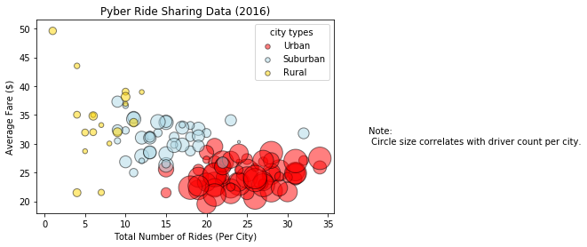
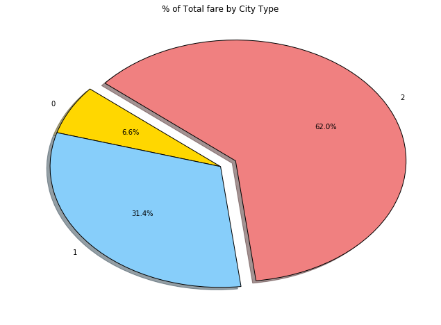
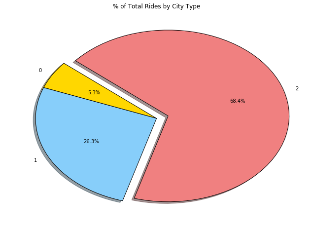
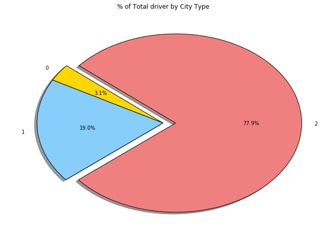

Three trend for this project:
1, total fare and average rides overall has negative relationship 
2, urban area has the largest percentage of total fare, total driver and total rides 
3, Rural area has the most spread data


```python
import matplotlib.pyplot as plt
import pandas as pd
import numpy as np
import os
import csv
```


```python
city = os.path.join('raw_data/city_data.csv')
ride = os.path.join('raw_data/ride_data.csv')

df_city = pd.read_csv(city)
df_ride = pd.read_csv(ride)

#see city info
df_city.head()
```


<div>
<style scoped>
    .dataframe tbody tr th:only-of-type {
        vertical-align: middle;
    }

    .dataframe tbody tr th {
        vertical-align: top;
    }

    .dataframe thead th {
        text-align: right;
    }
</style>
<table border="1" class="dataframe">
  <thead>
    <tr style="text-align: right;">
      <th></th>
      <th>city</th>
      <th>driver_count</th>
      <th>type</th>
    </tr>
  </thead>
  <tbody>
    <tr>
      <th>0</th>
      <td>Kelseyland</td>
      <td>63</td>
      <td>Urban</td>
    </tr>
    <tr>
      <th>1</th>
      <td>Nguyenbury</td>
      <td>8</td>
      <td>Urban</td>
    </tr>
    <tr>
      <th>2</th>
      <td>East Douglas</td>
      <td>12</td>
      <td>Urban</td>
    </tr>
    <tr>
      <th>3</th>
      <td>West Dawnfurt</td>
      <td>34</td>
      <td>Urban</td>
    </tr>
    <tr>
      <th>4</th>
      <td>Rodriguezburgh</td>
      <td>52</td>
      <td>Urban</td>
    </tr>
  </tbody>
</table>
</div>


```python
#see ride info
df_ride.head()
```


<div>
<style scoped>
    .dataframe tbody tr th:only-of-type {
        vertical-align: middle;
    }

    .dataframe tbody tr th {
        vertical-align: top;
    }

    .dataframe thead th {
        text-align: right;
    }
</style>
<table border="1" class="dataframe">
  <thead>
    <tr style="text-align: right;">
      <th></th>
      <th>city</th>
      <th>date</th>
      <th>fare</th>
      <th>ride_id</th>
    </tr>
  </thead>
  <tbody>
    <tr>
      <th>0</th>
      <td>Sarabury</td>
      <td>2016-01-16 13:49:27</td>
      <td>38.35</td>
      <td>5403689035038</td>
    </tr>
    <tr>
      <th>1</th>
      <td>South Roy</td>
      <td>2016-01-02 18:42:34</td>
      <td>17.49</td>
      <td>4036272335942</td>
    </tr>
    <tr>
      <th>2</th>
      <td>Wiseborough</td>
      <td>2016-01-21 17:35:29</td>
      <td>44.18</td>
      <td>3645042422587</td>
    </tr>
    <tr>
      <th>3</th>
      <td>Spencertown</td>
      <td>2016-07-31 14:53:22</td>
      <td>6.87</td>
      <td>2242596575892</td>
    </tr>
    <tr>
      <th>4</th>
      <td>Nguyenbury</td>
      <td>2016-07-09 04:42:44</td>
      <td>6.28</td>
      <td>1543057793673</td>
    </tr>
  </tbody>
</table>
</div>


```python
# merge dataframes
df_merged = pd.merge(df_city, df_ride, on='city')
df_merged.head()
```


<div>
<style scoped>
    .dataframe tbody tr th:only-of-type {
        vertical-align: middle;
    }

    .dataframe tbody tr th {
        vertical-align: top;
    }

    .dataframe thead th {
        text-align: right;
    }
</style>
<table border="1" class="dataframe">
  <thead>
    <tr style="text-align: right;">
      <th></th>
      <th>city</th>
      <th>driver_count</th>
      <th>type</th>
      <th>date</th>
      <th>fare</th>
      <th>ride_id</th>
    </tr>
  </thead>
  <tbody>
    <tr>
      <th>0</th>
      <td>Kelseyland</td>
      <td>63</td>
      <td>Urban</td>
      <td>2016-08-19 04:27:52</td>
      <td>5.51</td>
      <td>6246006544795</td>
    </tr>
    <tr>
      <th>1</th>
      <td>Kelseyland</td>
      <td>63</td>
      <td>Urban</td>
      <td>2016-04-17 06:59:50</td>
      <td>5.54</td>
      <td>7466473222333</td>
    </tr>
    <tr>
      <th>2</th>
      <td>Kelseyland</td>
      <td>63</td>
      <td>Urban</td>
      <td>2016-05-04 15:06:07</td>
      <td>30.54</td>
      <td>2140501382736</td>
    </tr>
    <tr>
      <th>3</th>
      <td>Kelseyland</td>
      <td>63</td>
      <td>Urban</td>
      <td>2016-01-25 20:44:56</td>
      <td>12.08</td>
      <td>1896987891309</td>
    </tr>
    <tr>
      <th>4</th>
      <td>Kelseyland</td>
      <td>63</td>
      <td>Urban</td>
      <td>2016-08-09 18:19:47</td>
      <td>17.91</td>
      <td>8784212854829</td>
    </tr>
  </tbody>
</table>
</div>


```python
group_city = df_merged.groupby(['city'])
average_fare = group_city['fare'].mean()
total_rides = group_city['ride_id'].nunique()
total_drivers = group_city['driver_count'].max()
city_type = group_city['type'].max()
summary_city = pd.DataFrame({'Average Fare ($)': average_fare,
                          'Total Number of Rides': total_rides,
                          'Total Number of Drivers': total_drivers,
                          'City Type': city_type})
# Urban
urban = summary_city.loc[summary_city['City Type'] == 'Urban']
rides_urban = urban['Total Number of Rides']
avg_fare_urban = urban['Average Fare ($)']
drivers_urban = urban['Total Number of Drivers']

# Suburban
suburban = summary_city.loc[summary_city['City Type'] == 'Suburban']
rides_suburban = suburban['Total Number of Rides']
avg_fare_suburban = suburban['Average Fare ($)']
drivers_suburban = suburban['Total Number of Drivers']

# Rural
rural = summary_city.loc[summary_city['City Type'] == 'Rural']
rides_rural = rural['Total Number of Rides']
avg_fare_rural = rural['Average Fare ($)']
drivers_rural = rural['Total Number of Drivers']

summary_city.head()
```


<div>
<style scoped>
    .dataframe tbody tr th:only-of-type {
        vertical-align: middle;
    }

    .dataframe tbody tr th {
        vertical-align: top;
    }

    .dataframe thead th {
        text-align: right;
    }
</style>
<table border="1" class="dataframe">
  <thead>
    <tr style="text-align: right;">
      <th></th>
      <th>Average Fare ($)</th>
      <th>City Type</th>
      <th>Total Number of Drivers</th>
      <th>Total Number of Rides</th>
    </tr>
    <tr>
      <th>city</th>
      <th></th>
      <th></th>
      <th></th>
      <th></th>
    </tr>
  </thead>
  <tbody>
    <tr>
      <th>Alvarezhaven</th>
      <td>23.928710</td>
      <td>Urban</td>
      <td>21</td>
      <td>31</td>
    </tr>
    <tr>
      <th>Alyssaberg</th>
      <td>20.609615</td>
      <td>Urban</td>
      <td>67</td>
      <td>26</td>
    </tr>
    <tr>
      <th>Anitamouth</th>
      <td>37.315556</td>
      <td>Suburban</td>
      <td>16</td>
      <td>9</td>
    </tr>
    <tr>
      <th>Antoniomouth</th>
      <td>23.625000</td>
      <td>Urban</td>
      <td>21</td>
      <td>22</td>
    </tr>
    <tr>
      <th>Aprilchester</th>
      <td>21.981579</td>
      <td>Urban</td>
      <td>49</td>
      <td>19</td>
    </tr>
  </tbody>
</table>
</div>


```python
urban_plot = plt.scatter(rides_urban, avg_fare_urban, s=drivers_urban*10, 
                         color='red', alpha=0.5, edgecolor='black', linewidths=1, 
                         label='Urban')
suburban_plot = plt.scatter(rides_suburban, avg_fare_suburban, s=drivers_suburban*10, 
                            color='lightblue', alpha=0.5, edgecolor='black',linewidths=1, 
                            label='Suburban')
rural_plot = plt.scatter(rides_rural, avg_fare_rural, s=drivers_rural*10, 
                         color='gold', alpha=0.5, edgecolor='black',linewidths=1, 
                         label='Rural')

lgnd = plt.legend(handles=[urban_plot,suburban_plot,rural_plot], loc ='best',title = 'city types')
lgnd.legendHandles[0]._sizes = [30]
lgnd.legendHandles[1]._sizes = [30]
lgnd.legendHandles[2]._sizes = [30]

plt.title('Pyber Ride Sharing Data (2016)')
plt.xlabel('Total Number of Rides (Per City)')
plt.ylabel('Average Fare ($)')

txt="Note:\n Circle size correlates with driver count per city."
plt.text(40, 30, txt, ha='left')


plt.show()
```





```python
#total fare
type_fare = df_merged.groupby('type')["fare"].sum().reset_index()
type_fare
```


<div>
<style scoped>
    .dataframe tbody tr th:only-of-type {
        vertical-align: middle;
    }

    .dataframe tbody tr th {
        vertical-align: top;
    }

    .dataframe thead th {
        text-align: right;
    }
</style>
<table border="1" class="dataframe">
  <thead>
    <tr style="text-align: right;">
      <th></th>
      <th>type</th>
      <th>fare</th>
    </tr>
  </thead>
  <tbody>
    <tr>
      <th>0</th>
      <td>Rural</td>
      <td>4255.09</td>
    </tr>
    <tr>
      <th>1</th>
      <td>Suburban</td>
      <td>20335.69</td>
    </tr>
    <tr>
      <th>2</th>
      <td>Urban</td>
      <td>40078.34</td>
    </tr>
  </tbody>
</table>
</div>


```python
city_fare = type_fare["fare"]
plt_city_fare = city_fare.plot(kind='pie', figsize=(11, 8), explode=[0,0,0.1], startangle=140, 
               colors=["Gold", "lightskyblue", "lightcoral"],
               shadow=True,
               autopct="%1.1f%%",
               wedgeprops = {'edgecolor' : 'black'} 
              )
plt.title("% of Total fare by City Type")
plt.ylabel("")
plt.show()
```





```python
#total ride
type_ride = summary_city.groupby('City Type')["Total Number of Rides"].sum().reset_index()
type_ride
```


<div>
<style scoped>
    .dataframe tbody tr th:only-of-type {
        vertical-align: middle;
    }

    .dataframe tbody tr th {
        vertical-align: top;
    }

    .dataframe thead th {
        text-align: right;
    }
</style>
<table border="1" class="dataframe">
  <thead>
    <tr style="text-align: right;">
      <th></th>
      <th>City Type</th>
      <th>Total Number of Rides</th>
    </tr>
  </thead>
  <tbody>
    <tr>
      <th>0</th>
      <td>Rural</td>
      <td>125</td>
    </tr>
    <tr>
      <th>1</th>
      <td>Suburban</td>
      <td>625</td>
    </tr>
    <tr>
      <th>2</th>
      <td>Urban</td>
      <td>1625</td>
    </tr>
  </tbody>
</table>
</div>


```python
city_ride = type_ride["Total Number of Rides"]
plt_city_ride = city_ride.plot(kind='pie', figsize=(11, 8), explode=[0,0,0.1], startangle=140, 
               colors=["Gold", "lightskyblue", "lightcoral"],
               shadow=True,
               autopct="%1.1f%%",
               wedgeprops = {'edgecolor' : 'black'} 
              )
plt.title("% of Total Rides by City Type")
plt.ylabel("")
plt.show()
```





```python
#total driver
type_driver = summary_city.groupby('City Type')["Total Number of Drivers"].sum().reset_index()
type_driver
```


<div>
<style scoped>
    .dataframe tbody tr th:only-of-type {
        vertical-align: middle;
    }

    .dataframe tbody tr th {
        vertical-align: top;
    }

    .dataframe thead th {
        text-align: right;
    }
</style>
<table border="1" class="dataframe">
  <thead>
    <tr style="text-align: right;">
      <th></th>
      <th>City Type</th>
      <th>Total Number of Drivers</th>
    </tr>
  </thead>
  <tbody>
    <tr>
      <th>0</th>
      <td>Rural</td>
      <td>104</td>
    </tr>
    <tr>
      <th>1</th>
      <td>Suburban</td>
      <td>635</td>
    </tr>
    <tr>
      <th>2</th>
      <td>Urban</td>
      <td>2607</td>
    </tr>
  </tbody>
</table>
</div>


```python
city_driver = type_driver["Total Number of Drivers"]
plt_city_driver = city_driver.plot(kind='pie', figsize=(11, 8), explode=[0,0,0.1], startangle=140, 
               colors=["Gold", "lightskyblue", "lightcoral"],
               shadow=True,
               autopct="%1.1f%%",
               wedgeprops = {'edgecolor' : 'black'} 
              )
plt.title("% of Total driver by City Type")
plt.ylabel("")
plt.show()
```




